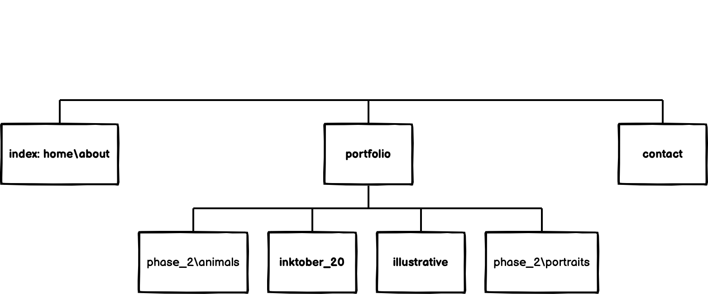
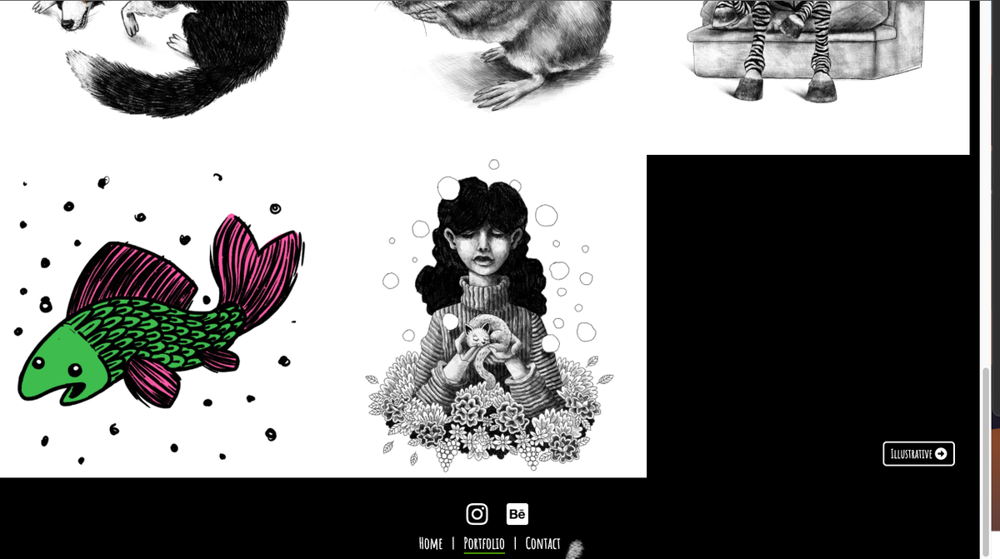
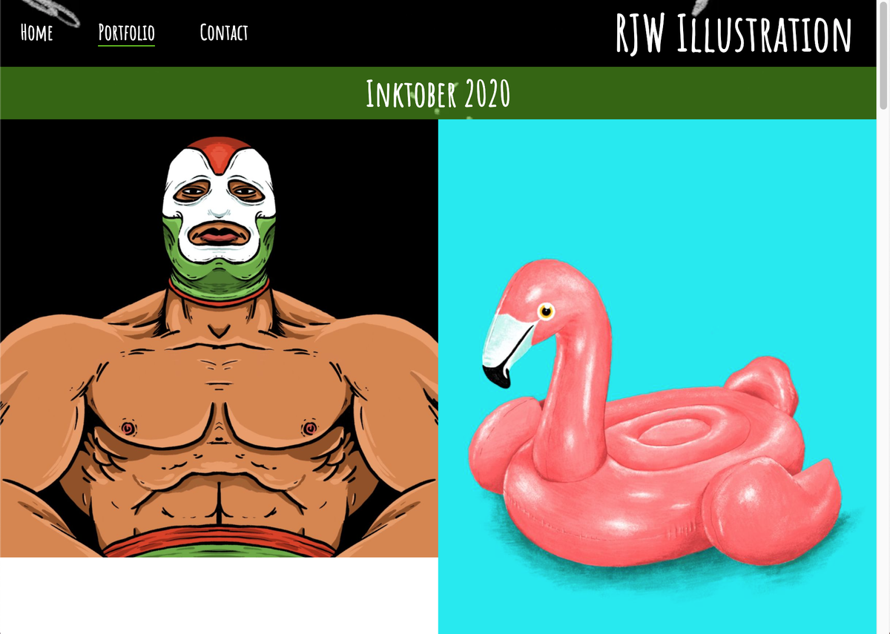
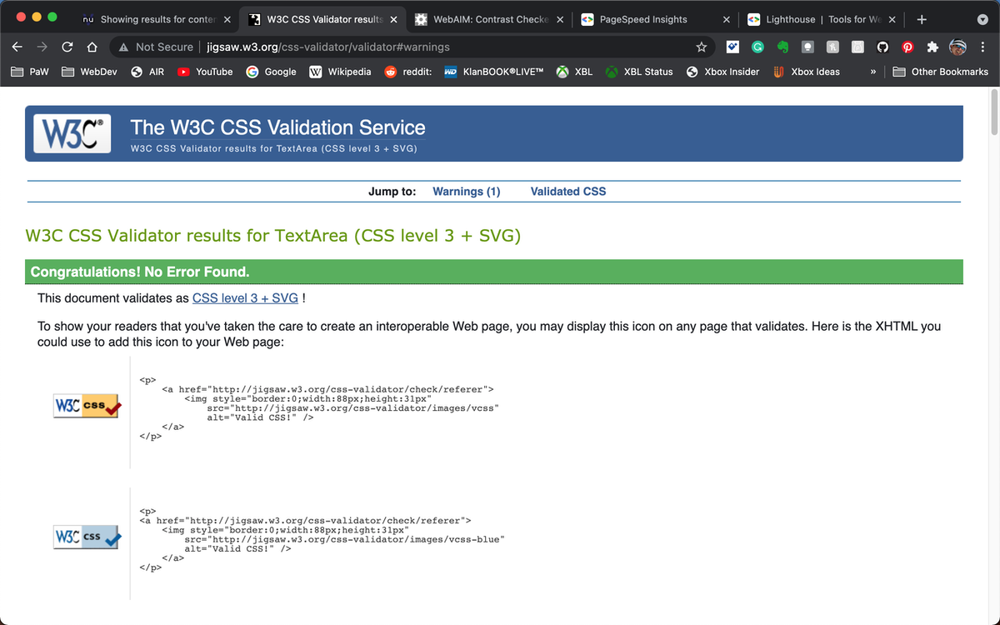

# ***TABLE OF CONTENTS***

- [RJW Illustration Online Portfolio](#rjw-illustration-online-portfolio)
  * [**Introduction**](#--introduction--)
      - [***Until now...***](#---until-now---)
- [UCD Phase 1: STRATEGY](#ucd-phase-1--strategy)
  * [PROJECT GOALS](#project-goals)
  * [External User Goals:](#external-user-goals-)
  * [Site Owner Goals:](#site-owner-goals-)
  * [Potential Features:](#potential-features-)
- [UCD Phase 2: SCOPE](#ucd-phase-2--scope)
    + [Analysis and grading of *Phase One considerations* allows a simple ***Strategy Table*** to be generated:](#analysis-and-grading-of--phase-one-considerations--allows-a-simple----strategy-table----to-be-generated-)
  * [Strategic Trade-offs](#strategic-trade-offs)
- [UCD Phase 3: STRUCTURE](#ucd-phase-3--structure)
  * [Initial **RJW Illustration** Site Map](#initial---rjw-illustration---site-map)
- [UCD Phase 4: SKELETON](#ucd-phase-4--skeleton)
  * [Initial **RJW Illustration** Wireframes for Mobile & Desktop](#initial---rjw-illustration---wireframes-for-mobile---desktop)
    + [Complete PDF versions of wireframes available here: [Mobile](readme_media/rjwi_planning_docs/pp-01_rjwi_wireframes_mobile.pdf) *and* [Desktop](readme_media/rjwi_planning_docs/pp-01_rjwi_wireframes_desktop.pdf)](#complete-pdf-versions-of-wireframes-available-here---mobile--readme-media-rjwi-planning-docs-pp-01-rjwi-wireframes-mobilepdf---and---desktop--readme-media-rjwi-planning-docs-pp-01-rjwi-wireframes-desktoppdf-)
- [UCD Phase 5: SURFACE](#ucd-phase-5--surface)
  * [DESIGN CHOICES](#design-choices)
  * [Fonts and Icons](#fonts-and-icons)
  * [Colours](#colours)
  * [Imagery](#imagery)
    + [All site imagery is original copyright material originated and provided by the stakeholder.](#all-site-imagery-is-original-copyright-material-originated-and-provided-by-the-stakeholder)
  * [TECHNOLOGIES](#technologies)
  * [Languages](#languages)
  * [Tools](#tools)
  * [FEATURES](#features)
  * [Site-wide Features](#site-wide-features)
  * [Home Page Features](#home-page-features)
  * [Portfolio Page Features](#portfolio-page-features)
  * [Gallery Page Features](#gallery-page-features)
  * [Contact Page Features](#contact-page-features)
  * [*Features Left to Implement*](#-features-left-to-implement-)
- [VERSION CONTROL](#version-control)
  * [Gitpod Workspaces](#gitpod-workspaces)
- [TESTING](#testing)
  * [AUTOMATED TESTING](#automated-testing)
  * [W3C Validator Testing](#w3c-validator-testing)
  * [MANUAL TESTING](#manual-testing)
  * [Manual Testing Results Summary](#manual-testing-results-summary)
  * [BUGS and FIXES](#bugs-and-fixes)
    + [**Bug:** Header logo breaking apart](#--bug----header-logo-breaking-apart)
    + [**Bug:** Gallery responsiveness for screens 600px and below](#--bug----gallery-responsiveness-for-screens-600px-and-below)
    + [**Bug:** Ugly response layouts at 615px and iPad screen width (768px)](#--bug----ugly-response-layouts-at-615px-and-ipad-screen-width--768px-)
- [Deployment](#deployment)
  * [Credits](#credits)
    + [Content](#content)

<small><i><a href='http://ecotrust-canada.github.io/markdown-toc/'>Table of contents generated with markdown-toc</a></i></small>

# RJW Illustration Online Portfolio

----

## **Introduction**

Rian Whiteside is an active, industrious Illustrator and digital artist based in the rural South West of the UK. Despite having a *distinctive **style***, *extensive **portfolio*** and *growing **client list***, he ***still** doesn't have a **website!***

#### ***Until now...***

**RJW Illustration** is a site that hopes showcase Rian's unique art style to a wider audience online, in a simple-yet-stylish experience. The site will be targeted toward users who enjoy discovering new artists to follow and artworks to appreciate. 

The **RJW Illustration** site will be useful for users and other artists wishing to see more of Rian's work, and also offer the opportunity to send him a message, enquire about commissions or discuss collaborations. 

---- 

# UCD Phase 1: STRATEGY 

## PROJECT GOALS

## External User Goals: 

- Viewing original illustrative artwork by RJW
- Basic information & social media links for RJW
- Ability to contact RJW about commissions or collaborations

  Additional ***user expectations*** for consideration include:
  - Intuitive/conventional navigation elements
  - Familiar and/or easily understandable site structure
  - Responsive: access site easily on any device

## Site Owner Goals:

- Establish a simple-yet-stylish web presence
- Ability to showcase their art to a wider audience online
- Opportunity for potential clients or collaborators to make contact
  
  Additional ***stakeholder concerns*** for consideration: 
  - Dark theme with some animated page element(s) preferred; page background/icons/logo
  - Multiple themed galleries rather than all-artworks-in-one
  - Include time-lapse video of digital art process
  - Potential requirement of e-commerce integration at a later date

## Potential Features:

Considering the goals, expectations and concerns detailed above, potential features for the RJW Illustration site should include:
- A stylish and effective design with easy, intuitive navigation - and some animation!
- Multiple thematic galleries of RJW artworks, e.g. Illustrative, Inktober 2020, Portraits, Animals
- Prominent contact methods; social media links, contact form
- 'About' details for RJW including:
  - Short artist bio
  - Video of digital art time-lapse
- Any back-end/preparatory work or features relevant to future e-commerce implimentation

---- 

# UCD Phase 2: SCOPE

### Analysis and grading of *Phase One considerations* allows a simple ***Strategy Table*** to be generated:

| OPPORTUNITY/PROBLEM/FEATURE | IMPORTANCE | VIABILITY/FEASIBILITY | ID    | 
|-----------------------------|:----------:|:---------------------:|:-------
| Stylish website             | 5          | 5                     | A     |
| Multiple artwork galleries  | 5          | 4                     | B     |
| Prominent contact options   | 5          | 5                     | C     |
| 'About' artist info         | 5          | 5                     | D     |
| E-commerce elements         | 3          | 1                     | E     |
| TOTAL                       | 23         | 20                    |       |

## Strategic Trade-offs

Plotting the Strategy Table results provides a visible indication of what is feasibily within the scope of the project at this time. As I am unable to meet all requirements at present, I will aim to provide RJW Illustration initially as an MVP or Minimum Viable Product, therefore: 
  Due to time and current-skill limitations (and to also remain close to the number of pages required for this project) the site will be delivered in phases.

  ***Initial Phase:*** Delivery of MVP, a fully functioning website, with the exception of
    
  - E-commerce features/preparations. As a low stakeholder priority, this will follow at a later date as required (and skill levels increase!)
  
  - Initial gallery count of two. Sufficient for proof of concept, subsequent galleries will be added in sunsequent phases.

----

# UCD Phase 3: STRUCTURE

## Initial **RJW Illustration** Site Map 

Maps generated in [**Balsamiq**](https://balsamiq.com) 

Prior to generating my wireframes in Balsamiq, I used it's handy Site Map element to better visualise the basic structure and navigation between proposed site pages. 

As with all good wireframes, they are only a guide and subject to change! Amalgamation of pages (following Project Planning session advice from my Mentor - thanks, Marcel!) and project phasing resulted in the final site layout below.

---- 

# UCD Phase 4: SKELETON

## Initial **RJW Illustration** Wireframes for Mobile & Desktop

Following current conventional practice, **RJW Illustration** was designed with a Mobile First approach.

All wireframes generated in [Balsamiq](https://balsamiq.com)

 

### Complete PDF versions of wireframes available here: [Mobile](readme_media/rjwi_planning_docs/pp-01_rjwi_wireframes_mobile.pdf) *and* [Desktop](readme_media/rjwi_planning_docs/pp-01_rjwi_wireframes_desktop.pdf)

---- 

# UCD Phase 5: SURFACE

## DESIGN CHOICES

## Fonts and Icons

All fonts utilised in this project were sourced from and served by [**Google Fonts**](https://fonts.google.com)
- **Heading Font:** *Amatic SC*
  
  *Amatic SC* is a cursive style font with an easy-going, hand-rendered feel. In collaboration with stakeholder it was chosen as it effectively compliments the overall aesthetic of both site focus and content.

- **Body Font:** *Open Sans*

  Utilising **Google Fonts** ***popular pairings*** feature, sans-serif font *Open Sans* was chosen from the options for its width and breathing space; a subtle counter to the condensed style of *Amatic*.

All icons utilised in this project were sourced from and served by [**FontAwesome**](https://fontawesome.com)

## Colours

The 60:40:10 rule was used when determining colours: 
 - **60% Background/Primary:** ***Black*** chosen as a ***stakeholder concern*** - the ultimate dark colour! 
 - **40% Body Text/Secondary:** ***White*** chosen as a perfect compliment to Primary (black) 
 - **10% Accent/Tertiary:** ***Chartreuse*** chosen as a zingy, lively contrast to Primary (black) and ***stakeholder*** preference 

## Imagery

### All site imagery is original copyright material originated and provided by the stakeholder.

## TECHNOLOGIES

During the course of this project I have utilised the following technologies:

## Languages

- [**HTML5**](https://html.com/html5/) (HyperText Markup Language) was used for structuring & presenting site content

- [**CSS**](https://www.css3.info/) (Cascading Style Sheets) was used to provide styling to the HTML

## Tools

- [**Git**](https://git-scm.com/) was used for version control (commit to Git and push to GitHub)

- [**Gitpod**](https://www.gitpod.io/) was used to write my code; an online IDE linked to the GitHub repository

- [**GitHub**](https://github.com/) was used to create the repository and store the project's code after being pushed from Git

- [**Chrome**](https://www.google.com/intl/en_uk/chrome/) used to debug & test source code using HTML5 and to test site responsiveness

- [**Balsamiq**](https://balsamiq.com) used to generate project site maps and wireframes

- [**FontAwesome**](https://fontawesome.com) used for project icons

- [**Google Fonts**](https://fonts.google.com) used for all fonts utilised in the project

- [**amiresponsive**](http://ami.responsivedesign.is/) used to check how responsive the site is on different devices

- [**Web Page Test**](https://www.webpagetest.org/) used to test site performance

- [**W3C Markup**](https://validator.w3.org/) and [**W3C Jigsaw**](http://jigsaw.w3.org/css-validator/) used to validate source HTML and CSS code

## FEATURES

## Site-wide Features

- **Site-wide Header with Logo and Navigation**

  - Visually balancing the top-left-aligned nav elements, the RJW Illustration logo is rendered top-right using Amatic SC, a cursive web font in a simple, hand-drawn style.
  - Featured on all website pages, the fully responsive header includes links to the Home page, Portfolio landing page and Contact page and is identical on each page to allow for easy navigation.
    - This allows the user to consistently navigate from page to page across all devices without having to revert back to the previous page via the ‘back’ button. 
  - The example below shows an underline in the site's chosen accent colour, Chartreuse, indicating the current **active** page.

  - ***Shown below:*** On mouse hover and whilst also maintaining the current-page indicator (an underline only), nav links to other pages are highlighted in the site accent colour to provide clear user-feedback, in this case; "click to be taken to Contact page [from the Home page]"

  
- **Site-wide Animated Page Background**

  - The main Home page section consists of an original animated (.mp4) background created by RJW 
    - RJW intends to regularly update the background with fresh animations, encouraging visitors to return and check for new work playing
  - Pages containing copy have been styled with a dark tinted panel behind to reduce contrast between the white copy and underlying animation, this assists users by enhancing contrast and legibility 
  

- **Site-wide Footer** 

  - The footer section includes links to Instagram and Behance external sites and will open to a new tab, allowing easy navigation for the user. This is valuable to site users as it encourages them to keep connected via social media.
  - Additional site-wide breadcrumb-style nav links included in the footer allow easy user navigation to Home, Portfolio and Contact pages at the bottom of long gallery pages and pages on smaller, responsive-styled screens.

## Home Page Features

- The Home page consists of two responsive elements:
  - ***Left [responsive: top]*** comprises of an 'About' heading above text on dark-tinted panel, containing brief information about RJW, encouraging getting in touch and thanking for visiting. Valuable to user relations as it conveys pertinent information in a friendly, approachable manner
  - ***Right [responsive: bottom]*** a paused and muted time-lapse video of RJW's digital art process for the 'Dizzy' illustration. Valuable to users as it provides an insight into RJW's methods and artistic process. 
    - In the interest of good UXD, THE VIDEO DOES NOT AUTOPLAY until user-invoked, looping thereafter until stopped 

 

## Portfolio Page Features

  - The Portfolio page serves as a landing page providing users with links to themed galleries of work. 
    - This is valuable to the user as it enables them to easily choose between the different thematic styles of illustration RJW creates 
  - Two gallery choices initially available. Flexbox CSS method utilised allows easy addition & styling for subsequent gallery pages as required

  - On mouse hover over image a Gallery Title is made visible, indicating which Gallery will be selected when clicked. This has user value as it assists in clear navigation to artworks.

## Gallery Page Features

  - The gallery provides the visitor with a smooth flow of high-quality RJW artworks. This is valuable to the user as they are be able to easily access and browse the themed galleries of art RJW produces. 
  - A Gallery Title heading of white text upon a dark-tinted background sits immediately below the header, adding value by clearly informing visitors which gallery they are browsing
  - The gallery page is responsive, with @media queries for; 768px and below (1-column); 1024px and below (2-column) and full-screen (3-column). Valuable to users as large, clear images are maintained on medium and small screens.

**Gallery Responses: Full screen | 1024px and below | 768px and below**

  - Additional navigation styled at foot of page, enabling users to switch sideways through galleries, i.e. from one gallery to an adjacent gallery, without having to revisit the Portfolio page. Enriches the user experience by intuitively eliminating unnecessary navigation steps when swapping Gallery.

## Contact Page Features

  - To reinforce familiar user experience this page exactly matches styling and layout established on the home page, consisting of two responsive elements:
    - ***Left [responsive: top]*** made up of a 'Contact RJW Illustration' heading above text on dark-tinted panel, containing a friendly Call-To-Action encouraging getting in touch, a reiteration of social media links (which open in a new browser tab) and a brief list of some of the artistic services RJW offers. Valuable to users as it conveys pertinent information in a friendly, approachable manner.
    - ***Right [responsive: bottom]*** a clear Call-To-Action 'Get in touch!' heading above a simple form element on dark-tinted panel, cheerfully encourages user interaction. Valuable as it provides clear and easy methods to make contact with RJW.  
    - The validated form requires the input of user's first & last name, email address and a message before the 'Say hullo!' (submit) input activates and allows form submission. Adds value as in addition to providing users a means of contact, valid submissions also yield user data for RJW.
      - User receives verification of successfully submitted form data.

 

## *Features Left to Implement*

- Identified as **Strategic Trade-offs** at ***UXD Phase 2***, **Further Gallery Pages** and **E-commerce Implimentation** will be addressed, skills permitting, as and when required by the stakeholder.

----

# VERSION CONTROL

Managed within **GitHub** and **Gitpod** via regular commits pushed to GitHub remote servers:

## Gitpod Workspaces
1. Starting from GitHub, clone the Code Institute template by clicking Use This Template and copying to my repo. Launch Workspace by clicking GitPod button - this action is only performed once and the workspace is subsequently reopened through GitPod.

2. Start the Gitpod Workspace which opens an online IDE editor window.
    
    - Update GitHub by committing from GitPod

3. During editing save the code regularly, using git add ., git commit -m "commit message here" and git push Bash commands to push changes to the GitHub repository.

4. Meaningful commit messages allow easy roll-back of any changes to earlier versions.

# TESTING 

## AUTOMATED TESTING

## W3C Validator Testing 

- HTML
  - No errors were returned when passing through the official [W3C validator](https://validator.w3.org)

- CSS
  - No errors were found when passing through the official [(Jigsaw) validator](https://jigsaw.w3.org)

**Google Developer Tools**

- I made use of the built-in **Chrome Dev Tools** to experiment and debug while coding, in addition to testing simulated responsive behaviour across a wide range of mobile and desktop devices, and finally checking all pages Performance using **Lighthouse**. 

  - See all [Lighthouse screenshots here](readme_media/test_lighthouse).

    - I spent a lot of time (too much!) chasing Performance scores for my pages and eventually replaced and re-linked all .png images with .jpeg alternatives.

**Response Testing**

In order to make sure that RJW Illustration was responsive to all device sizes, I used [amiresponsive](http://ami.responsivedesign.is/)

  - See all [amiresponsive screenshots here](readme_media/test_amiresponsive).

**WebAIM**

- I used [WebAIM](https://webaim.org/resources/contrastchecker/) to check colour contrast

**WebPageTest**

- I used [WebPageTest](https://www.webpagetest.org/) set to London/Chrome as a final test for all pages.

    - Both Gallery pages were initally flagged for uncompressed images, which resulted in a second image overhaul, where I re-optimised, replaced and re-linked all .jpeg images with smaller fresh versions!

## MANUAL TESTING

In addition to my own testing a link to the project was shared to family & friends for rigorous testing across varied devices and screen sizes.

  - **Browsers** including: 
    - Chrome
    - Safari
    - Edge

  - **Devices** including: 
    - iPhone SE (Gen 1)
    - iPhone 11
    - iPhone 12 Mini
    - Google Pixel 4a
    - iPad Pro (2018)
    - iPad Air (2020)
    - MacBook Pro (2015)
    - Windows 10 PC 

## Manual Testing Results Summary

**All Pages**

| TEST | OUTCOME | PASS/FAIL |
|---|---|:---:|
| Header & Footer | Ensure all header, footer & nav elements behave as expected: Active/Hover states; | PASS |
|  | Ensure all styled responsive behaviour rules are met as expected | PASS |
|  | Ensure social media links behave as expected and open in new tabs | PASS |
| Background Video | Ensure appropriate behaviour across-site: loads & plays; response scaling; | PASS |

**Home Page**

| TEST | OUTCOME | PASS/FAIL |
|---|---|:---:|
| Video | Ensure expected behaviour: autoplay disabled, muted, loop enabled, plays on demand | PASS |
| Responsive | Ensure responsive behaviour rules are met as expected | PASS |

**Portfolio Page**

| TEST | OUTCOME | PASS/FAIL |
|---|---|:---:|
| Gallery Covers | Ensure expected behaviour: Hover state | PASS |
| Responsive | Ensure responsive behaviour rules are met as expected | PASS |

**Contact Page**

| TEST | OUTCOME | PASS/FAIL |
|---|---|:---:|
| Social media links | Ensure social media links behave as expected and open in new tabs | PASS |
| Responsive | Ensure responsive behaviour rules are met as expected | PASS |
| Form element | Ensure expected behaviour: Validation; confirmation | PASS |

**Gallery Page**

| TEST | OUTCOME | PASS/FAIL |
|---|---|:---:|
| Footer Gallery Switch Link | Ensure expected behaviour: Correct page linked | PASS |
| Responsive | Ensure responsive behaviour rules are met as expected | PASS |

## BUGS and FIXES

### **Bug:** Header logo breaking apart

! INSERT SCREENSHOT !

**Issue:** During window resizing RJW Illustration logo would split into two lines. 

**Solution:** Googled the issue, found and implemented the following fix:

How to Prevent Word Wrap on a Web Page: HTML Method
If you only have the one-off instance of two or more words that you want to force the browser to keep on a single line, the easiest way is to use the non-breaking space character, "&nbsp;", to separate those words instead of a normal space.

Sourced from: https://www.thesitewizard.com/css/prevent-word-wrapping.shtml September 2021.

### **Bug:** Gallery responsiveness for screens 600px and below

**Issue:** During responsive testing the columns wouldn't flex from two to one when dropping below 600px.

**Solution:** Finally realised the code was good but the CSS styling order wasn't! Moving the '@media...max-width: 992px' query from after/below the '@media...max-width: 600px" query to before/above it in the CSS heirarchy fixed the issue.

### **Bug:** Ugly response layouts at 615px and iPad screen width (768px)

**Issue:** Awkward break noticed during Response testing

**Solution:** Amended media queries to eliminate the issue

# Deployment

- The site was deployed to GitHub pages. The steps to deploy are as follows: 
  - In the GitHub repository, navigate to the Settings tab 
  - Click the Pages section in the sidebar
  - From the source section drop-down menu, select the main branch
  - Once the main branch has been selected, the page will be automatically refreshed with a detailed ribbon display to indicate the successful deployment. 

The live link can be found here - https://alfa23.github.io/portfolio-project-one/ 

## Credits 

### Content 

- The icons in the footer were taken from [Font Awesome](https://fontawesome.com/)

/* Add a slash symbol (/) before/behind each list item - code below pasted from https://www.w3schools.com/howto/howto_css_breadcrumbs.asp */
.breadcrumb li+li:before {
    padding: 8px;
    color: #fff;
    content: "/\00a0";
  }

/* Add page-container code to manage footer positioning - code below sourced from https://www.freecodecamp.org/news/how-to-keep-your-footer-where-it-belongs-59c6aa05c59c/ •/

Flexbox styling learnt, borrowed and adapted from w3Schools: https://www.w3schools.com/css/css3_flexbox.asp

